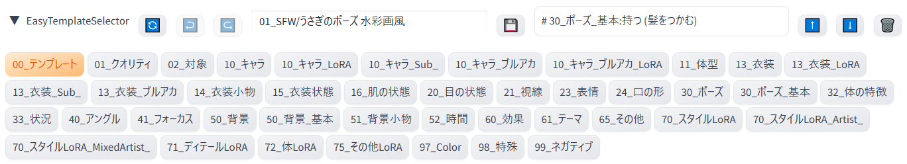

# Easy Template Selector

[Easy Prompt Selector](https://github.com/blue-pen5805/sdweb-easy-prompt-selector)
の改造版です。

独特なプロンプトの書き方をすることで、キャラの変更などを容易にできるようにしています。

https://github.com/user-attachments/assets/bdbc3e6c-161f-498f-96c7-950938b90c3a


# インストール方法

WebUIとreForgeで動作確認しています

WebUIの`Extensions` - `Install from URL`に以下のURLを入力してインストールしてください。

```
https://github.com/kidonaru/sdweb-easy-template-selector
```

既存のテンプレートの読み込みには下記モデルが必要です

- Nova Anime XL v6.0
- WAI-NSFW-illustrious-SDXL v13.0

別途LoRAなどを参照している場合もあるので、適宜インストールしてください

また、`Settings` - `User Interface` - `Quicksettings list` の項目に`CLIP_stop_at_last_layers` を追加してください

`Clip skip: 2` 以外ではテンプレートの読み込みが正常にできない可能性があります

# 機能

## テンプレートの読み込み/保存
- `templates`ディレクトリ以下にpnginfoを`.txt`で保存しておくと、`00_テンプレート`に表示され、読み込むことができます
  - プロンプトとメタ情報を読み込んで反映します
- `💾`ボタンを押すと現在のプロンプトとメタ情報を`templates`ディレクトリ以下に保存することができます
  - 既存のテンプレートを上書きすると拡張機能の更新に失敗することがあるので、別名で保存することを推奨します
- テンプレートは階層構造で管理可能（例：`templates/03_Test/てすと.txt`）

## プロンプトの構造化
- プロンプトをカテゴリごとに分類して管理しています
- *タグを追加すると、既存のカテゴリを自動で上書きします*
  - 単純な追加は`Ctrl`キーを押しながら行うと、既存のカテゴリを上書きせずに追加できます
- ネガティブプロンプトも同様に管理可能 (`99_ネガティブ`カテゴリは自動的にネガティブプロンプトに反映)

### プロンプトサンプル

```
# URL: {{プロンプトの参考URL}},

# 01_クオリティ:Model (Nova Anime XL),
masterpiece, best quality, amazing quality, very aesthetic, high resolution, ultra-detailed, absurdres, newest, scenery,
# 02_対象 (一人の女の子(強調)),
1girl,solo,
# 10_キャラ_ブルアカ:トリニティ (カズサ),
kazusa \(blue archive\),red eyes,black hair, animal ears,halo,choker,(hooded jacket:1.1),
# 50_背景_基本:基本 (屋外),
outdoors,
```

タグボタンを押すと
```
# {{カテゴリ}} ({{タグ名}}),
{{プロンプト}},
```
というフォーマットでプロンプトに反映されます

## アンドゥ/リドゥ機能
- プロンプトの変更履歴を保持
- 最大20件の履歴を保存

## マウスオーバーでタグの中身を表示
- タグ名にカーソルを乗せると、そのタグの内容をツールチップで表示

## タグカラーのサポート
- タグ名に`[#RRGGBB]`形式で色指定するとボタンの色に反映されます (例: `赤いタグ[#FF0000]`)


# UI



- `🔄`: テンプレートとタグの再読み込み
- `↩️`: プロンプトの変更を元に戻す（アンドゥ）
- `↪️`: プロンプトの変更をやり直す（リドゥ）
- `テンプレート名`: 保存するテンプレートの名前を入力
- `💾`: 現在のプロンプトとメタ情報をテンプレートとして保存
- `編集中のプロンプト`: 編集中のプロンプトを表示
- `⬆️`: 編集中のプロンプトを上に移動
- `⬇️`: 編集中のプロンプトを下に移動
- `🗑️`: 編集中のプロンプトを削除


# タグの追加

一度拡張機能を起動したあとに`tags`ディレクトリのファイルにタグを追加すればUIに反映されます

既存のファイルに追記することも可能ですが、今後更新が入ることもあるので別ファイルとして追加を推奨します

`10_キャラ_ほげほげ.txt`のようにカテゴリIDだけ合わせると同カテゴリ扱いになり、タグ追加時に上書き対象になります


# タグの更新履歴

拡張機能を更新しても、タグの更新は反映されません

拡張機能を更新後、対象の更新ファイルを`tags`ディレクトリから削除してからWebUIを再起動すると更新が反映されます (面倒な場合は`tags`ディレクトリ内のyml全削除で反映されます)

ローカルでファイルの変更をしていた場合は、`tags_examples`のファイルを直接開いて手動で変更内容を持ってくる必要があります


- 2025/05/07: `30_ポーズ.yml`を更新、LoRA系を`30_ポーズ_LoRA.yml`に分離
- 2025/05/07.2: `32_体の特徴.yml`を削除、中身を`16_肌の状態.yml`と`15_衣装状態.yml`にマージ
- 2025/05/07.3: `10_キャラ.yml`と`10_キャラ_LoRA.yml`の更新、一部キャラの`anime screencap`を削除


# 注意

生成した画像を公開するときはモザイクなど適切な処理をしてからアップロードしてください
