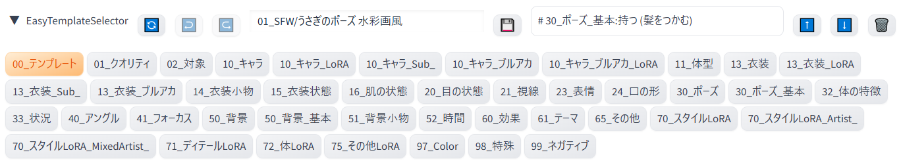

# Easy Template Selector

[Easy Prompt Selector](https://github.com/blue-pen5805/sdweb-easy-prompt-selector)
の改造版です。

独特なプロンプトの書き方をすることで、キャラの変更などを容易にできるようにしています。

https://github.com/user-attachments/assets/bdbc3e6c-161f-498f-96c7-950938b90c3a


# インストール方法

WebUI・reForge・Forge Neo で動作確認しています

WebUIの`Extensions` - `Install from URL`に以下のURLを入力してインストールしてください。

```
https://github.com/kidonaru/sdweb-easy-template-selector
```

## 必要なモデル

既存のテンプレートの読み込みには下記モデルが必要です

| モデル | ファイル名 | 配布元 |
| --- | --- | --- |
| Nova Anime XL v6.0 | `novaAnimeXL_ilV60` | [Civitai](https://civitai.com/models/376130/nova-anime-xl?modelVersionId=1610231) |
| WAI-illustrious-SDXL v17.0 | `waiIllustriousSDXL_v170` | [Civitai](https://civitai.red/models/827184/wai-illustrious-sdxl?modelVersionId=2883731) |

## よく使うLoRA

多くのテンプレートが下記のLoRAを参照しています (Civitaiでダウンロードできます)

| タグ名 | ファイル名 | 配布元 |
| --- | --- | --- |
| Smooth Detailer Booster v3 | `Smooth_Booster_v3` | [Civitai](https://civitai.com/models/1145743/smooth-detailer-booster-noobaiillustriouspony?modelVersionId=1784760) |
| detaILeReij | `r-hrtdrp` | [Civitai](https://civitai.com/models/1031108/detailereij) |
| MyTest | `MyTest` | [Civitai](https://civitai.com/models/1340344/mytest) |

上記以外のLoRAを参照しているテンプレートもあるので、適宜インストールしてください

## 必須設定

`Settings` - `User Interface` - `Quicksettings list` の項目に`CLIP_stop_at_last_layers` を追加してください

`Clip skip: 2` 以外ではテンプレートの読み込みが正常にできない可能性があります

# 機能

## テンプレートの読み込み/保存
- `templates`ディレクトリ以下にpnginfoを`.txt`で保存しておくと、`00_テンプレート`に表示され、読み込むことができます
  - プロンプトとメタ情報を読み込んで反映します
- `💾`ボタンを押すと現在のプロンプトとメタ情報を`templates`ディレクトリ以下に保存することができます
  - 既存のテンプレートを上書きすると拡張機能の更新に失敗することがあるので、別名で保存することを推奨します
- テンプレートは階層構造で管理可能（例：`templates/03_Test/てすと.txt`）

## プロンプトの構造化
- プロンプトをカテゴリごとに分類して管理しています
- *タグを追加すると、既存のカテゴリを自動で上書きします*
  - 単純な追加は`Ctrl`キーを押しながら行うと、既存のカテゴリを上書きせずに追加できます
- ネガティブプロンプトも同様に管理可能 (`99_ネガティブ`カテゴリは自動的にネガティブプロンプトに反映)

### プロンプトサンプル

```
# URL: {{プロンプトの参考URL}},

# 01_クオリティ:Model (Nova Anime XL),
masterpiece, best quality, amazing quality, very aesthetic, high resolution, ultra-detailed, absurdres, newest, scenery,
# 02_対象 (一人の女の子(強調)),
1girl,solo,
# 10_キャラ_ブルアカ:トリニティ (カズサ),
kazusa \(blue archive\),red eyes,black hair, animal ears,halo,choker,(hooded jacket:1.1),
# 50_背景_基本:基本 (屋外),
outdoors,
```

タグボタンを押すと
```
# {{カテゴリ}} ({{タグ名}}),
{{プロンプト}},
```
というフォーマットでプロンプトに反映されます

## アンドゥ/リドゥ機能
- プロンプトの変更履歴を保持
- 最大20件の履歴を保存

## マウスオーバーでタグの中身を表示
- タグ名にカーソルを乗せると、そのタグの内容をツールチップで表示

## タグカラーのサポート
- タグ名に`[#RRGGBB]`形式で色指定するとボタンの色に反映されます (例: `赤いタグ[#FF0000]`)

## プロンプト補完 (オートコンプリート)
- プロンプト欄で行頭に `#` を打つと、そのあとの文字列でタグを検索して候補を表示します
  - ポジティブ欄には `99_ネガティブ` 以外のタグ、ネガティブ欄には `99_ネガティブ` のタグだけが出ます
  - 候補は最大20件表示されます

### 操作方法

| キー | 動作 |
| --- | --- |
| `↓` / `↑` | 候補の選択を移動（端で折り返し） |
| `Enter` / `Tab` | 選択中の候補で確定 |
| `Esc` | 候補を閉じる |

- マウスでもクリックで確定できます
- 候補が出ている間の `Enter` は確定に使われます。そのまま改行したいときは `Esc` で閉じてから押してください

候補が閉じるタイミングは下記の4つです

- `Esc` を押したとき
- 候補を確定したとき
- 候補が0件になったとき
- ポップアップとプロンプト欄の外をクリックしたとき

### 検索対象

検索対象は下記の4種類です

- タグ名（日本語ラベル）
- タグの中身（英語プロンプト）
- カテゴリ名
- 確定後のコメント行と同じ `カテゴリ (タグ名)` の形式
  - 入力済みの行を打ち直すときは、そのままの形で打てば同じセクションが引けます

IMEの全角カッコ `（` と半角 `(`、大文字小文字は区別しません

### 確定時の動作

```
# 屋外          ← ここで確定すると
```
```
# 50_背景_基本:基本 (屋外),
outdoors,       ← コメント行とタグ行がまとめて挿入される
```

- 入力済みのセクションを打ち直した場合は、コメント行に続く古いタグ行ごと置き換えます
  - ただし次の行が空行かコメント行のときは、コメント行だけを置き換えます
- 確定した内容はアンドゥ（`↩️`）で元に戻せます
- 確定するとタグ情報のドロップダウンも、その行のセクションに切り替わります

### 補完に出ないタグ

テキスト挿入以外の副作用を持つため、下記は候補に出ません

- `00_テンプレート` / `90_モデル` / `96_解像度` の各カテゴリ
- `01_クオリティ:Model` / `99_ネガティブ:Model` の各グループ

## Hires CFG Scale の継承 (Forge Neo 向け)
- reForge では `Hires CFG Scale: 0` は「本体の `CFG Scale` を継承する」という意味を持ちます
  - Forge Neo にはこの仕様がなく、0 はそのまま CFG 0 として扱われてしまいます
- 本拡張機能は生成の直前に 0 を `CFG Scale` の値へ置き換えることで、reForge と同じ挙動を再現します
  - あわせて `Hires CFG Scale` スライダーの下限を 0 に緩和しています (0 を入力できるようにするため)
  - `Hires negative prompt` も編集可能にしています (継承後は 0 でもネガティブが効くため)
- `Settings` - `Easy Template Selector` の `Hires CFG Scale が 0 のとき CFG Scale を継承する (reForge 互換)` でOFFにできます
  - 反映にはブラウザの再読み込みが必要です
- 同梱テンプレートの `Hires CFG Scale` は 0 のままにしてあります。`CFG Scale` を変更すると Hires 側も追従します
  - 0 のまま保存してほしいので、テンプレートを保存するときはテンプレート適用直後の状態から行ってください
  - 生成画像のpnginfoには継承後の実値が焼き込まれます。そのため `PNG Info` から送った状態で保存すると、0 が実値のまま固定されてしまいます


# UI



- `🔄`: テンプレートとタグの再読み込み
- `↩️`: プロンプトの変更を元に戻す（アンドゥ）
- `↪️`: プロンプトの変更をやり直す（リドゥ）
- `テンプレート名`: 保存するテンプレートの名前を入力
- `💾`: 現在のプロンプトとメタ情報をテンプレートとして保存
- `編集中のプロンプト行`: 編集中のプロンプト行を表示
- `⬆️`: 編集中のプロンプト行を上に移動
- `⬇️`: 編集中のプロンプト行を下に移動
- `🗑️`: 編集中のプロンプト行を削除


# タグの追加

`tags`ディレクトリのファイルにタグを追加すればUIに反映されます

`tags`ディレクトリは拡張機能に同梱されており、拡張機能を更新するとタグの更新も反映されます

既存のファイルに追記するとローカルの変更が更新時に競合するので、別ファイルとして追加することを推奨します

`10_キャラ_ほげほげ.yml`のようにカテゴリIDだけ合わせると同カテゴリ扱いになり、タグ追加時に上書き対象になります

`10_キャラ_ほげほげ_.yml`のようにファイル名の末尾を`_`にすると更新の対象外になるので、ローカル専用のタグはこの形式を推奨します


# 注意

生成した画像を公開するときはモザイクなど適切な処理をしてからアップロードしてください
